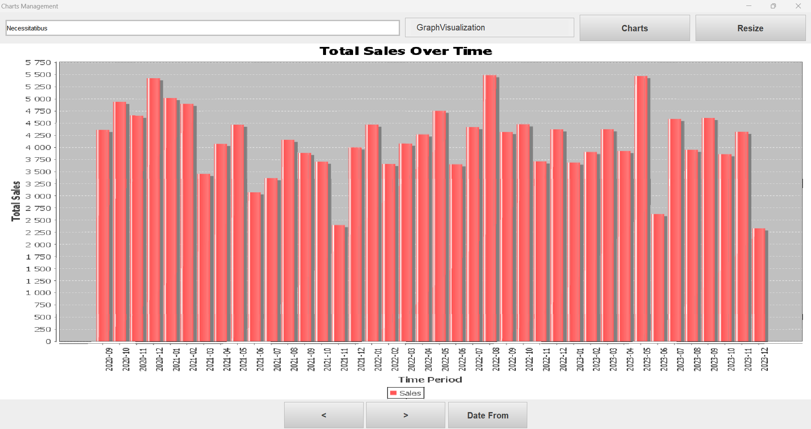

# Storage Management System 🏭

> A sophisticated warehouse management system built with Java Swing and Neo4j, featuring custom UI components and advanced data visualization capabilities.

## 🌟 Features

### 📊 Data Management
- **Custom Table View**: Sophisticated data presentation with responsive design
- **Advanced Search**: Real-time substring search across all data fields
- **Dynamic Filtering**: Customizable dropdown filters for efficient data navigation
- **Fullscreen Mode**: Responsive resize functionality for optimal viewing

### 🎯 Visualization
- **Graph Network View**: 
  - Interactive node-based data representation
  - Detailed node information panel
  - Real-time graph manipulation
  - Connected data visualization

### 📈 Analytics Dashboard
- **Custom Calendar Integration**: 
  - Time period selection for sales analysis
  - Intuitive date range picker
- **Performance Metrics**:
  - Total sales over time
  - Top 10 best-selling products (by units)
  - Top 10 most profitable products
  - Average delivery time per supplier
  - Stock level analysis (current vs. minimal)

### 🔐 Security
- Custom-built authentication system
- User registration with validation
- Secure login interface
- Role-based access control

## 🛠 Technology Stack

### Core Technologies
- **Java 21**: Core programming language
- **Neo4j 5.15.0**: Graph database for data storage
- **JGraphX 4.2.2**: Graph visualization
- **JFreeChart 1.0.13**: Statistical charts and graphs

### Architecture
- MVC (Model-View-Controller) design pattern
- Singleton Factory pattern
- Custom UI components
- Responsive design principles

## 🚀 Installation and Setup

1. **Project Setup**
```bash
# Clone the repository
git clone [repository-url]

# Navigate to project directory
cd StorageManagement
```

2. **Database Configuration**
- Launch Neo4j Desktop
- Create new project
- Import `neo4j.dump` file
- Configure database settings:
  ```properties
  dbms.security.auth_enabled=false
  ```

3. **Application Launch**
```bash
# Run using Maven
mvn clean install
mvn exec:java -Dexec.mainClass="org.example.views.MainWindow"
```

## 📸 Screenshots and Features

### 1. Data Table View

- Custom-built responsive table interface
- Advanced search functionality
- Dynamic dropdown navigation
- Fullscreen resize capability
- Completely custom-made UI components

### 2. Smart Search Functionality

- Real-time substring search across all rows
- High-performance filtering system
- Instantly updates as you type enter
- Searches through all data fields simultaneously

### 3. Graph Visualization

- Interactive node-based data representation
- Click-to-view detailed node information panel
- Visual representation of data relationships
- Dynamic graph manipulation capabilities

### 4. Custom Calendar Integration

- Purpose-built calendar component for date selection
- Intuitive date range picker
- Used for generating time-based analytics
- Smooth user interaction

### 5. Time-Based Analytics

- Detailed sales analysis over selected time periods
- Interactive chart visualization
- Custom date range filtering

### 6. Product Performance Analysis

- Top 10 best-selling products by units sold
- Clear visual representation

### 7. Profitability Analysis

- Top 10 most profitable products
- Revenue vs. cost analysis
- Clear profit visualization

### 8. Supplier Performance

- Average delivery time per supplier
- Performance tracking

### 9. Inventory Management

- Current stock vs. minimal stock quantity comparison
- Inventory level monitoring

## 🤝 Contributing
Contributions are welcome! Please feel free to submit a Pull Request.

## 📧 Contact
For any queries or support, please contact:
- Email: vashalomdizekonstantine@gmail.com
- Project Link: https://github.com/KonstantineVashalomidze/Storage-Management

---
*Note: This project uses custom-built UI components without relying on standard Swing library components, ensuring a unique and responsive user experience.*

